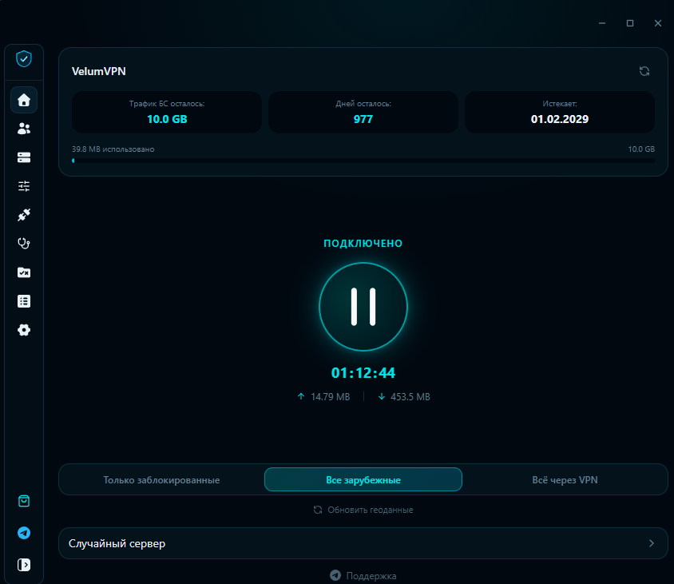
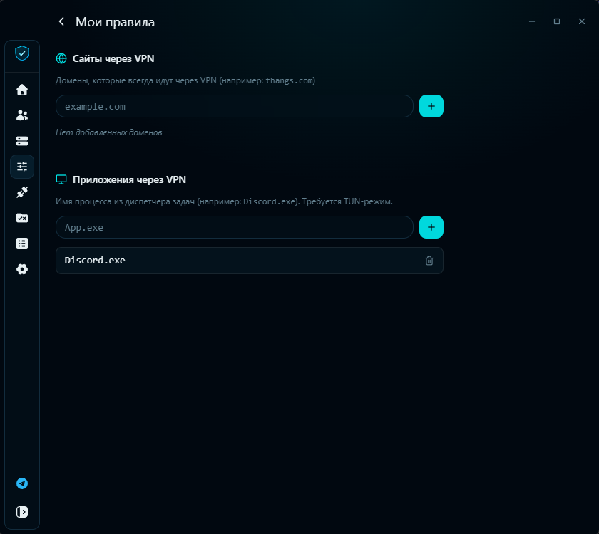

# VelumVPN Desktop

**Десктопный VPN-клиент для Windows и Linux на базе [Mihomo](https://github.com/MetaCubeX/mihomo)**

---

## Скриншоты

&nbsp;

---

## Особенности

- **Три режима маршрутизации** — переключение в один клик:
  - 🔒 **Только заблокированные** — через VPN идут только сайты, заблокированные в РФ (Telegram, Discord и др.), остальное напрямую
  - 🌍 **Все зарубежные** — весь иностранный трафик через VPN, российские сайты напрямую
  - 🔁 **Всё через VPN** — полный туннель

- **Мои правила** — добавляй любые сайты и приложения через VPN прямо из интерфейса, без редактирования конфигов:
  - 🌐 Домены (например: `thangs.com`)
  - 🖥️ Приложения по имени процесса (например: `Discord.exe`)

- **Геоданные от [runetfreedom](https://github.com/runetfreedom/russia-v2ray-rules-dat)** — актуальные базы заблокированных ресурсов РФ (`ru-blocked`), обновляются прямо в приложении

- **Автозагрузка геоданных** — при первом запуске геофайлы скачиваются автоматически с прогресс-баром, VPN доступен сразу после загрузки

---

## Скачать

Перейди в [Releases](https://github.com/Jidos86/VelumVPN/releases/latest) и скачай файл для своей платформы:

| Платформа | Файл |
|-----------|------|
| Windows x64 (установщик) | `VelumVPN_x64-setup.exe` |
| Windows x64 (портативный) | `VelumVPN_x64-portable.7z` |
| Linux x64 | `VelumVPN_x64.deb` / `.rpm` |

---

## Установка подписки

1. Открой приложение → нажми **+** или перейди в **Профили**
2. Вставь ссылку на подписку → нажми **Сохранить**
3. Выбери режим маршрутизации и нажми кнопку подключения

---

## Поддержка

Telegram: [@Veluum_support_bot](https://t.me/Veluum_support_bot)

---

## Основано на

- [koala-clash](https://github.com/coolcoala/koala-clash) — Electron-оболочка для Mihomo
- [Mihomo](https://github.com/MetaCubeX/mihomo) — VPN ядро (Clash.Meta)
- [runetfreedom/russia-v2ray-rules-dat](https://github.com/runetfreedom/russia-v2ray-rules-dat) — геоданные для РФ
